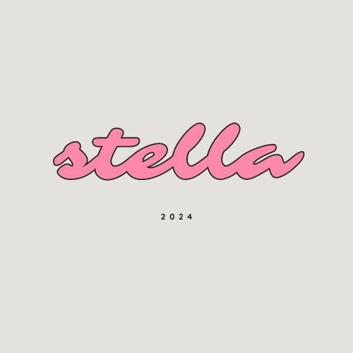

 

# Project Title

Hey patients, thank you for clicking to Medi hub care hospital.

MEDI HUB APP

*your health ,our priority*

# Author name

**Stellarawat Waithira Njuguna.**

# Description 🎞️
MediHub Medical Care is a comprehensive healthcare facility dedicated to providing high-quality medical services to the community. At MediHub, we prioritize patient-centric care, combining advanced medical technology with compassionate service to ensure the best outcomes for our patients.

Our services encompass a wide range of specialties, including primary care, cardiology, orthopedics, pediatrics, emergencies and women's health. We offer state-of-the-art diagnostic facilities, including imaging and laboratory services, to support accurate and timely diagnoses.

MediHub is staffed by a team of highly qualified healthcare professionals, including experienced doctors, nurses, and support staff, who are committed to delivering personalized care tailored to each patient’s unique needs. Our multidisciplinary approach ensures comprehensive treatment plans that address both acute and chronic conditions.

In addition to our in-house services, MediHub Medical Care provides a robust telemedicine platform, allowing patients to access medical consultations and follow-ups from the comfort of their homes. Our patient portal offers easy appointment scheduling, prescription refills, and access to medical records, enhancing the overall patient experience.

At MediHub, we believe in the importance of preventive care and wellness education. We offer various programs and workshops focused on lifestyle management, nutrition, and disease prevention to help our patients lead healthier lives.

# Setup
At Medi hub care app,you will be able to;

-login and sign up. 

-you can input your condition and how you are feeling.

-that will help you out on your condition.

-give you strategic solution to your problem.

# link to a live site on github:⛓️

[github](https://github.com/stellarawat/my-final-project?tab=readme-ov-file)

# License 💀

[License](License)